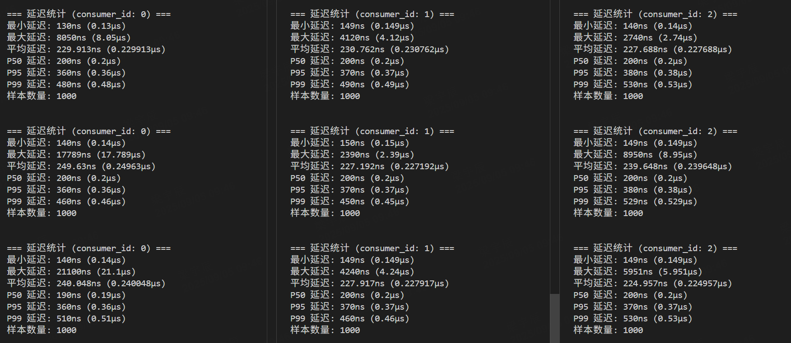

# 高性能 SPMC 无锁消息队列

一个基于共享内存的无锁 SPMC（Single Producer Multiple Consumer）消息队列实现，专为高频交易和低延迟应用设计。该项目提供了 header-only 的 C++ 库，支持多进程通信，实现了纳秒级的消息传递延迟。

## 核心特性

### SPMC 架构设计
- **单生产者多消费者**: 支持一个生产者同时向多个独立的消费者发送消息
- **无锁实现**: 基于原子操作的环形缓冲区，避免互斥锁开销
- **独立消费进度**: 每个消费者维护独立的读取指针，互不影响
- **消息广播**: 同一消息可被所有消费者独立消费

### 高性能优化
- **共享内存**: 进程间零拷贝通信，减少数据拷贝开销
- **原子操作**: 使用 C++11 原子类型确保线程安全
- **内存对齐**: 64字节缓存行对齐，避免 false sharing
- **CPU 亲和性**: 支持线程绑定特定 CPU 核心
- **实时调度**: 支持 SCHED_FIFO 实时调度策略

### 系统特性
- **Header-only**: 单头文件库，易于集成
- **自动兼容性检查**: 智能检测现有共享内存兼容性
- **灵活配置**: 可配置队列容量、消息大小、消费者数量
- **高精度时间戳**: 纳秒级时间戳用于延迟测量

## 架构设计

### 核心组件

```
┌─────────────────┐    ┌─────────────────────────────┐    ┌─────────────────┐
│     Producer    │───▶│     SharedMemory Queue      │◀───│   Consumer 1    │
│   (Single)      │    │   ┌─────────────────────┐   │    │                 │
└─────────────────┘    │   │   RingBuffer        │   │    └─────────────────┘
                       │   │   - Head (atomic)   │   │                      
                       │   │   - Tail[0]         │   │    ┌─────────────────┐
                       │   │   - Tail[1]         │   │◀───│   Consumer 2    │
                       │   │   - Tail[N]         │   │    │                 │
                       │   └─────────────────────┘   │    └─────────────────┘
                       └─────────────────────────────┘              
                                                           ┌─────────────────┐
                                                      ◀───│   Consumer N    │
                                                           │                 │
                                                           └─────────────────┘
```

### 内存布局

```
共享内存布局:
┌─────────────────────────────────────────────────────────────────┐
│                    RingBufferHeader                             │
│  ┌─────────────┬─────────────┬─────────────┬─────────────────┐  │
│  │ head(atomic)│    size     │ element_size│  num_consumers  │  │
│  └─────────────┴─────────────┴─────────────┴─────────────────┘  │
│  ┌─────────────┬─────────────┬─────────────┬─────────────────┐  │
│  │ tail[0]     │   tail[1]   │   tail[2]   │     ...         │  │
│  │ (atomic)    │  (atomic)   │  (atomic)   │                 │  │
│  └─────────────┴─────────────┴─────────────┴─────────────────┘  │
├─────────────────────────────────────────────────────────────────┤
│                        Message Data                            │
│  ┌─────────────────────────────────────────────────────────┐   │
│  │ Message[0]: [Header][Payload]                           │   │
│  ├─────────────────────────────────────────────────────────┤   │
│  │ Message[1]: [Header][Payload]                           │   │
│  ├─────────────────────────────────────────────────────────┤   │
│  │                        ...                              │   │
│  └─────────────────────────────────────────────────────────┘   │
└─────────────────────────────────────────────────────────────────┘
```

### 消息结构

```cpp
// 消息头部（自动添加）
struct MessageHeader {
    MessageType type;      // 消息类型
    uint32_t payload_size; // 有效载荷大小
    uint64_t timestamp;    // 高精度时间戳（纳秒）
    uint64_t sequence_num; // 序列号
};

// 用户自定义消息结构示例
struct MarketData {
    char symbol[16];  // 股票代码
    double price;     // 价格
    int volume;       // 成交量
    long timestamp;   // 用户时间戳
};
```

## API 使用指南

### 1. 定义消息类型

```cpp
#include "message_queue.h"

// 定义你的消息结构
struct MyMessage {
    char symbol[16];
    double price;
    uint32_t volume;
};
```

### 2. 生产者使用

```cpp
#include "message_queue.h"

void producer_example() {
    // 创建消息队列
    // 参数: 队列名称, 容量(消息数), 最大载荷大小, 消费者数量
    MessageQueue queue("/my_queue", 1024, sizeof(MyMessage), 2);
    
    // 准备消息数据
    MyMessage msg;
    strcpy(msg.symbol, "AAPL");
    msg.price = 150.25;
    msg.volume = 1000;
    
    // 发送消息
    if (queue.produce(MessageType::MARKET_DATA, &msg, sizeof(MyMessage))) {
        std::cout << "Message sent successfully" << std::endl;
    } else {
        std::cout << "Queue is full" << std::endl;
    }
}
```

### 3. 消费者使用

```cpp
#include "message_queue.h"

void consumer_example(uint32_t consumer_id) {
    // 连接到现有队列（参数必须匹配）
    MessageQueue queue("/my_queue", 1024, sizeof(MyMessage), 2);
    
    // 准备接收缓冲区
    std::vector<char> buffer(sizeof(MessageHeader) + queue.max_payload_size());
    
    while (true) {
        // 消费消息
        if (queue.consume(buffer.data(), consumer_id)) {
            // 解析消息
            const GenericMessage* generic_msg = 
                reinterpret_cast<const GenericMessage*>(buffer.data());
            const MyMessage* msg = 
                reinterpret_cast<const MyMessage*>(generic_msg->payload);
            
            // 计算延迟
            auto now = std::chrono::high_resolution_clock::now().time_since_epoch().count();
            auto latency = now - generic_msg->header.timestamp;
            
            std::cout << "Consumer " << consumer_id 
                      << " received: " << msg->symbol 
                      << " Price: " << msg->price
                      << " Latency: " << latency << "ns" << std::endl;
        } else {
            // 队列为空，可以短暂休眠或忙等待
            std::this_thread::sleep_for(std::chrono::microseconds(1));
        }
    }
}
```

### 4. 多消费者场景

```cpp
#include <thread>

void multi_consumer_example() {
    const uint32_t NUM_CONSUMERS = 3;
    
    // 启动多个消费者线程
    std::vector<std::thread> consumers;
    for (uint32_t i = 0; i < NUM_CONSUMERS; ++i) {
        consumers.emplace_back([i]() {
            consumer_example(i);  // 每个消费者使用不同的 ID
        });
    }
    
    // 等待所有消费者线程
    for (auto& t : consumers) {
        t.join();
    }
}
```

## 性能优化

### 编译优化

```bash
# 生产环境构建
mkdir build-prod && cd build-prod
cmake -DCMAKE_BUILD_TYPE=PROD ..
make -j$(nproc)
```

**PROD 构建参数**: `-O3 -march=native -mtune=native -DNDEBUG -flto -ffast-math -funroll-loops`

### 运行时优化

```cpp
#include "message_queue.h"

void setup_high_performance() {
    // 1. 绑定CPU核心
    CPUAffinity::bindToCPU(0);  // 生产者绑定核心0
    
    // 2. 设置实时优先级（需要root权限）
    CPUAffinity::setRealtimePriority(99);
    
    // 3. 获取CPU核心数
    int cpu_count = CPUAffinity::getCPUCount();
    std::cout << "Available CPU cores: " << cpu_count << std::endl;
}
```

### 系统级优化

```bash
# 设置CPU性能模式
echo performance | sudo tee /sys/devices/system/cpu/cpu*/cpufreq/scaling_governor

# 启用大页内存
echo 1024 | sudo tee /proc/sys/vm/nr_hugepages

# 减少定时器迁移
echo 0 | sudo tee /proc/sys/kernel/timer_migration

# 使用实时调度运行
sudo chrt -f 99 ./consumer &
sudo chrt -f 95 ./producer &

# CPU亲和性绑定
sudo taskset -c 0 ./producer &    # 生产者绑定核心0
sudo taskset -c 1 ./consumer1 &   # 消费者1绑定核心1  
sudo taskset -c 2 ./consumer2 &   # 消费者2绑定核心2
```

## 构建和测试

### 环境要求

- **编译器**: GCC 7+ 或 Clang 6+ (支持 C++17)
- **CMake**: 3.10+
- **操作系统**: Linux (测试环境: Ubuntu 18.04+)
- **依赖**: vcpkg (用于管理 Google Test)

### 安装依赖

```bash
# 1. 安装 vcpkg
git clone https://github.com/Microsoft/vcpkg.git
cd vcpkg
./bootstrap-vcpkg.sh

# 2. 设置环境变量
export VCPKG_ROOT=/path/to/vcpkg
export PATH=$VCPKG_ROOT:$PATH

# 3. 安装依赖
vcpkg install gtest
```

### 构建项目

```bash
# Debug 构建（开发调试）
mkdir build-debug && cd build-debug
cmake -DCMAKE_BUILD_TYPE=Debug ..
make -j$(nproc)

# PROD 构建（生产环境）
mkdir build-prod && cd build-prod  
cmake -DCMAKE_BUILD_TYPE=PROD ..
make -j$(nproc)
```

### 运行测试

```bash
# 运行所有测试
make test

# 或直接运行测试程序
./test/ringbuffer_tests
./test/no_create_tests
```

### 运行示例

```bash
# 基本运行
./bin/consumer &
./bin/producer

# 多消费者示例
./bin/consumer -c 3 -id 0 &    # 消费者0
./bin/consumer -c 3 -id 1 &    # 消费者1  
./bin/consumer -c 3 -id 2 &    # 消费者2
./bin/producer -c 3            # 生产者指定3个消费者

# 限制消息数量
./bin/producer -n 10000        # 生产10000条消息
./bin/consumer -n 10000        # 消费10000条消息
```

## 性能指标

三个消费者，每1000条消息统计一次



## 高级特性

### 共享内存管理

```cpp
// 检查现有共享内存兼容性
bool compatible = MessageQueue::isHeaderCompatible(
    "/my_queue", 1024, sizeof(MyMessage), 2);

// 强制重新创建共享内存
MessageQueue queue("/my_queue", 1024, sizeof(MyMessage), 2, 
                   true);  // force_recreate = true

// 仅连接模式（不创建新的）  
MessageQueue queue("/my_queue", 1024, sizeof(MyMessage), 2,
                   false,  // force_recreate = false
                   true);  // no_create = true
```

### 消息类型定义

```cpp
// 扩展消息类型
enum class MessageType : uint32_t {
    UNKNOWN = 0,
    MARKET_DATA,
    ORDER_UPDATE, 
    HEARTBEAT,
    TRADE_EXECUTION,  // 新增交易执行
    RISK_UPDATE,      // 新增风险更新
    // 添加更多类型...
};
```
